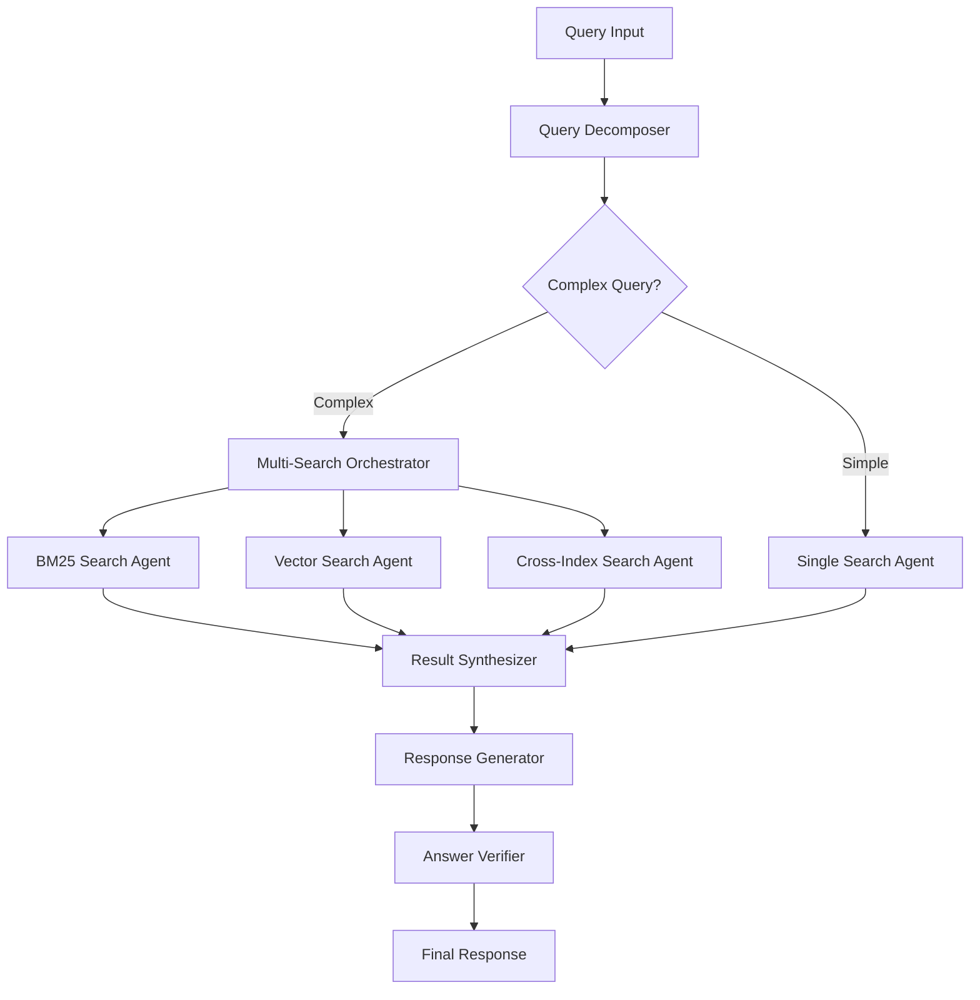

# LangGraph Integration Architecture Design

## Overview
This document outlines the integration of LangGraph for query decomposition and multi-step retrieval, transforming the current monolithic query processing pipeline into a sophisticated multi-agent workflow system.

## Current Pipeline Analysis
The existing system follows a linear pipeline:
1. **Normalize Query** (`normalize_query`) - Text preprocessing
2. **Determine Intent** (`determine_intent`) - LLM-based classification
3. **Retrieve Information** (`_perform_retrieval`) - Hybrid BM25+KNN+RRF search
4. **Generate Response** (`generate_response`) - LLM-based answer generation
5. **Verify Answer** (`verify_answer`) - Quality assessment

## LangGraph Workflow Architecture

### Core Design Principles
1. **Query Decomposition**: Break complex queries into sub-queries
2. **Parallel Execution**: Run multiple search operations concurrently  
3. **Adaptive Routing**: Dynamic decision-making based on query complexity
4. **Result Synthesis**: Intelligent aggregation of multi-step results
5. **State Management**: Maintain context across workflow steps

### Workflow Graph Structure



### Agent Definitions

#### 1. Query Decomposer Agent
- **Purpose**: Analyze and break down complex queries
- **Tools**: LLM with structured output for query analysis
- **Decision Logic**: Determines if query needs decomposition
- **Output**: List of sub-queries or single query classification

#### 2. Search Orchestrator Agent  
- **Purpose**: Coordinate parallel search operations
- **Tools**: Dynamic task delegation using LangGraph Send API
- **Capabilities**: 
  - Multi-index searching (confluence, swagger, etc.)
  - Parallel BM25 and vector searches
  - Cross-domain entity searches

#### 3. Specialized Search Agents
- **BM25 Search Agent**: Text-based retrieval
- **Vector Search Agent**: Semantic similarity search  
- **Cross-Index Agent**: Multi-corpus searches
- **Entity Search Agent**: Specific utility/API searches

#### 4. Result Synthesizer Agent
- **Purpose**: Intelligently combine results from multiple searches
- **Tools**: LLM-based result ranking and deduplication
- **Features**:
  - MMR diversification across sources
  - Query-result relevance scoring
  - Context window optimization

#### 5. Response Generator Agent
- **Purpose**: Generate comprehensive answers from synthesized results
- **Tools**: Context-aware LLM generation
- **Capabilities**:
  - Multi-source attribution
  - Query-specific formatting
  - Comparative analysis for multi-part questions

### State Schema

```python
class WorkflowState(TypedDict):
    # Input
    original_query: str
    user_context: Dict[str, Any]
    
    # Query Processing
    query_complexity: str  # "simple" | "complex" | "multi_part"
    sub_queries: List[str]
    search_strategies: List[str]
    
    # Search Results
    search_results: Annotated[List[SearchResult], operator.add]
    result_sources: Dict[str, List[SearchResult]]
    
    # Generation
    synthesized_context: str
    response_chunks: Annotated[List[str], operator.add]
    
    # Metadata
    workflow_path: List[str]
    performance_metrics: Dict[str, float]
```

## Implementation Strategy

### Phase 1: Core Workflow Setup
1. Install LangGraph dependencies
2. Create base workflow structure
3. Implement Query Decomposer agent
4. Set up state management

### Phase 2: Search Agent Implementation
1. Convert existing search functions to LangGraph tools
2. Implement parallel search orchestration
3. Add cross-index search capabilities
4. Integrate MMR and RRF fusion

### Phase 3: Response Generation Enhancement
1. Implement Result Synthesizer agent
2. Enhance Response Generator with multi-source awareness
3. Add comparative analysis capabilities
4. Integrate answer verification

### Phase 4: Advanced Features
1. Add human-in-the-loop capabilities
2. Implement conversation memory
3. Add performance monitoring
4. Create debugging and visualization tools

## Example Use Cases

### Multi-Part Query
**Input**: "Compare the login API rate limits for Customer Summary Utility and Enhanced Transaction Utility"

**Workflow Path**:
1. Query Decomposer → Identifies comparison query requiring 2+ searches
2. Search Orchestrator → Spawns parallel searches:
   - Search Agent 1: "Customer Summary Utility login API rate limits"
   - Search Agent 2: "Enhanced Transaction Utility login API rate limits"
3. Result Synthesizer → Combines and structures results for comparison
4. Response Generator → Creates comparative analysis

### Iterative Exploration
**Input**: "What authentication methods are available and which is most secure?"

**Workflow Path**:
1. Query Decomposer → Identifies two-phase query
2. Phase 1: Search for available authentication methods
3. Result Synthesizer → Analyzes results, identifies need for security comparison
4. Phase 2: Search for security comparisons of found methods
5. Response Generator → Synthesizes comprehensive answer

## Integration Points

### Existing Pipeline Integration
- **Resource Manager**: Maintain Phase 1 performance optimizations
- **Telemetry**: Enhanced logging for multi-step workflows
- **Search Services**: Wrap existing functions as LangGraph tools
- **Response Services**: Enhance with multi-source capabilities

### Configuration Management
- New workflow configuration parameters
- Agent-specific model settings
- Search strategy preferences
- Performance tuning options

## Performance Considerations
- Parallel search execution reduces total latency
- Intelligent caching for sub-query results
- Resource pooling across workflow steps
- Graceful degradation for failed agents

## Testing Strategy
- Unit tests for individual agents
- Integration tests for complete workflows
- Performance benchmarks vs current pipeline
- A/B testing with complex query scenarios

## Migration Plan
1. **Gradual Rollout**: Feature flag to switch between pipelines
2. **Fallback Strategy**: Graceful degradation to current pipeline
3. **Performance Monitoring**: Real-time metrics comparison
4. **User Feedback**: Collect quality assessments

This architecture will transform the utilities assistant into a sophisticated multi-agent system capable of handling complex, multi-faceted queries with improved accuracy and comprehensive responses.